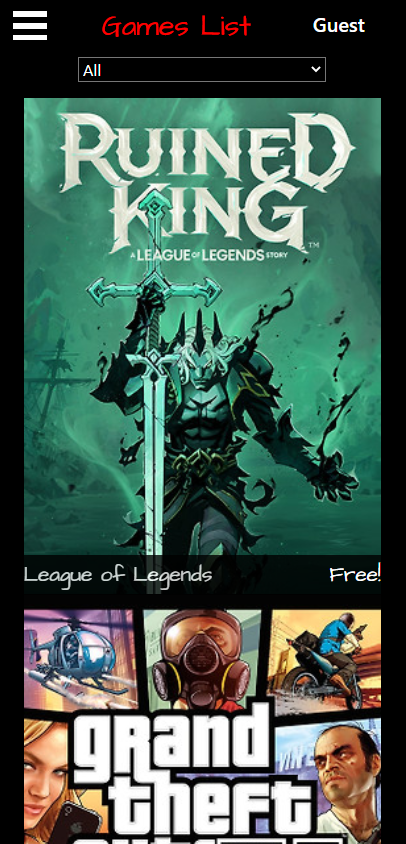
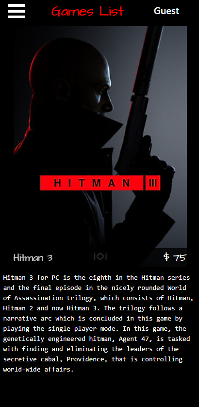
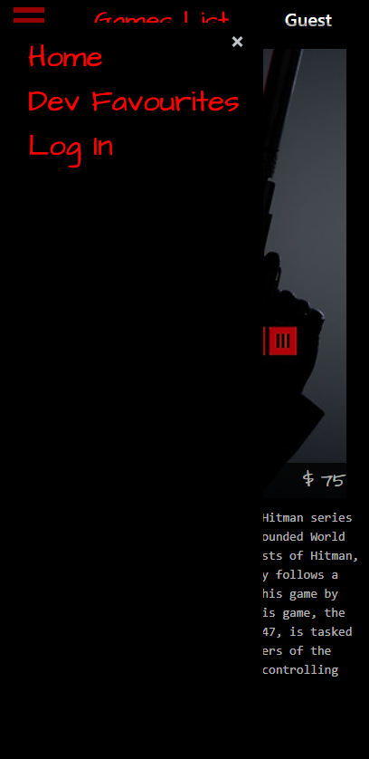
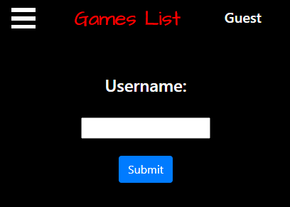

[![Contributors][contributors-shield]][contributors-url]
[![Forks][forks-shield]][forks-url]
[![Stargazers][stars-shield]][stars-url]
[![Issues][issues-shield]][issues-url]

<!-- PROJECT LOGO -->
<br />
<p align="center">
  <a href="https://github.com/e71az/games-list-react" style="text-decoration: none;">
    
  </a>

  <h3 align="center">React & Redux Project --> games-list-react<h3>
  <p align="center">
    <a href="#table-of-contents"><strong>Explore the docs »</strong></a>
    <br />
    <br />
    -
    <a href="https://github.com/e71az/games-list-react/issues">Report a Bug</a>
    -
    <a href="https://github.com/e71az/games-list-react/issues">Request a Feature</a>
    -
  </p>
</p>

<!-- TABLE OF CONTENTS -->

## Table of Contents

- [About the Project](#about-the-project)

  - [Screenshots](#screenshots)
  - [Demo Link](#demo-link)
  - [Design Credits](#design-credits)
  - [Prerequisites](#prerequisites)
  - [Installation](#installation)
  - [Automated Tests](#automated-tests)
  - [Built With](#built-with)

- [Contributors](#contributors)
- [Contributing](#contributing)
- [Show Your Support](#show-your-support)
- [License](#license)

<!-- ABOUT THE PROJECT -->

## About The Project

This is the **games-list-react** final project where users are able to watch basic information about certain games like name, description, image and price. This is the standalone React & Redux app to withdraw the information from my rails API app.

# Screenshots

## Games:



## Developer Favourites:


## Game Info:



## Hamburguer Menu:



## Log In:



## Demo Link

[Live Demo Link](https://flavourbomb.netlify.app/)

## Design Credits

[Marc-Antoine Roy on Behance](https://www.behance.net/gallery/11351281/NomNom)

## Prerequisites

- Code editor
- Supported Browser
- Node.js installed

## Installation

To get a local copy up and running follow these simple example steps:

- Clone this repository into your local machine

```bash
  $ git clone https://github.com/e71az/games-list-react.git
```

- Run:

```bash
  $ npm install
```

- Run:

```bash
  $ npm start
```

- Enter in your web browser address bar:

  localhost:8080

- Wait for the games to load

- Navigate the app!

## Automated Tests

- Run the command and see the output

```
$ npm test (and press a)
```

### Built With

This project was built using these technologies:

- Javascript
- HTML
- React & Redux Toolkit
- My games-list-api API made with Rails
- React testing library
- Netlify
- ESlint and Stylelint as linters

## Contributors

👤 **Elias Castañeda**

- Github: [@e71az](https://github.com/e71az)
- Linkedin: [@e71az](https://www.linkedin.com/in/eliasecasta/)

## Contributing

:handshake:

Contributions, issues and feature requests are welcome!
Feel free to check the [issues page](https://github.com/e71az/games-list-react/issues)

## Show your support

Give a :star: if you like this project!

<!-- MARKDOWN LINKS & IMAGES -->
<!-- https://www.markdownguide.org/basic-syntax/#reference-style-links -->

[contributors-shield]: https://img.shields.io/github/contributors/e71az/games-list-react.svg?style=flat-square
[contributors-url]: https://github.com/e71az/games-list-react/graphs/contributors
[forks-shield]: https://img.shields.io/github/forks/e71az/games-list-react
[forks-url]: https://github.com/e71az/games-list-react/network/members
[stars-shield]: https://img.shields.io/github/stars/e71az/games-list-react
[stars-url]: https://github.com/e71az/games-list-react/stargazers
[issues-shield]: https://img.shields.io/github/issues/e71az/games-list-react.svg?style=flat-square
[issues-url]: https://github.com/e71az/games-list-react/issues

## License

📝 This project is [MIT](https://opensource.org/licenses/MIT) licensed.
